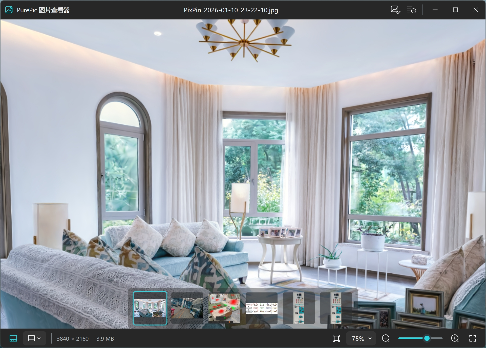

# PurePic

PurePic 是一个面向 Windows x64 的轻量级原生图片查看器，关注快速启动、快速显示首张图片，以及简洁顺手的图片浏览体验。

> 本项目的设计、代码和文档均由 AI 制作。



## 主要功能

- 使用 WIC 解码 PNG、JPEG、BMP、GIF、TIFF 和 WebP 等常见图片格式
- 支持缩放、平移、适应窗口、实际大小和全屏查看
- 支持同目录图片切换及可停靠的缩略图栏
- 支持注册图片右键菜单，以及跳转到 Windows 默认应用设置
- 支持 Per-Monitor V2 DPI 和 Windows 原生窗口行为
- 使用有界后台任务队列加载缩略图，并按字节预算管理缩略图缓存

## 技术栈

- Rust 2024 Edition
- windows-rs / Win32
- Windows Imaging Component (WIC)
- Direct2D / DirectWrite
- Direct3D 11 / DXGI

发布目标为单个 `PurePic.exe`，运行时不依赖外部图片或图标资源。

## 系统兼容性

- Windows 11 x64：当前开发和测试所使用的系统
- Windows 10 x64：从所使用的系统 API 来看理论上可以运行；不支持的 Win11 外观属性会自动降级，但目前尚未在真实 Win10 环境中测试

## 构建与运行

需要 Rust 1.94 或更高版本，以及可用的 MSVC Windows 构建环境。

```powershell
cargo build --release
```

构建产物位于 `target\release\PurePic.exe`。可以直接启动程序，也可以传入图片路径：

```powershell
.\target\release\PurePic.exe "D:\Pictures\example.jpg"
```
